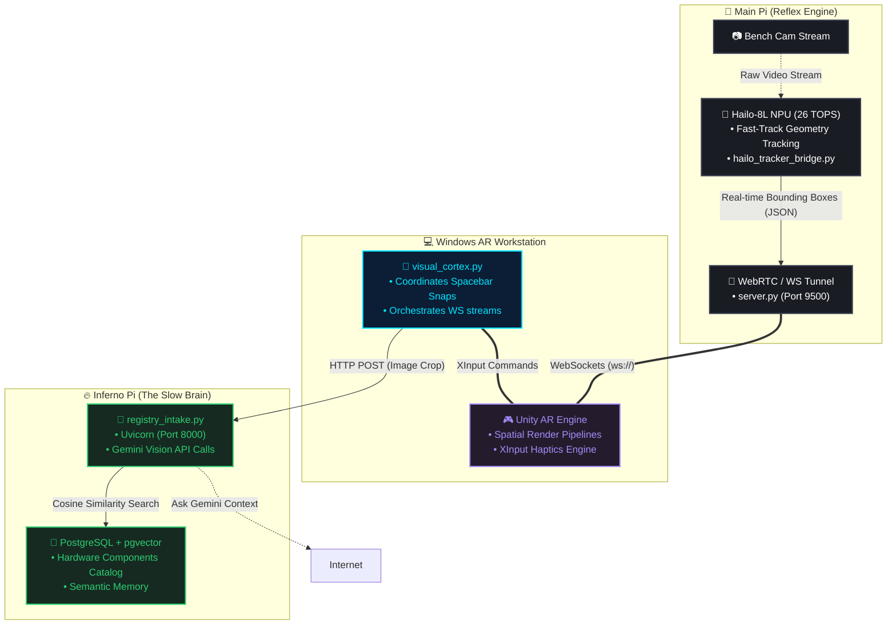

# 🌐 Sensor Ecology & AR Guidance: System Architecture

The AR Guidance project operates on a deeply distributed, edge-heavy microservices architecture. To ensure ultra-low latency for AR interactions while supporting computationally heavy LLM semantic queries, the system requires an explicit separation of concerns across multiple physical hardwares.

## 1. High-Level Topology

---

## 2. Core Modules Breakdown

### A. The Reflex Engine (Main Pi + Hailo)
This is the physical "eyes" of the system. 
- **Hardware:** Raspberry Pi 5 equipped with a Hailo-8L NPU M.2 HAT.
- **Role:** Consume camera feeds directly from the workbench, run extremely optimized object detection models (YOLOv8 format compiled for Hailo), and stream bounding box coordinates over local WebSockets at lowest possible latency (target 30+ FPS). 
- **Key Files:** `hailo_tracker_bridge.py` and `server.py`.

### B. The AR Workstation (Windows)
The endpoint that the user interacts with. 
- **Hardware:** High-powered Windows workstation running Unity, connected to an Xbox Elite Controller for haptic feedback.
- **Role:** Consumes the WebSocket streams from the Main Pi, projecting those boxes over the video feed into an AR context. Controls the "Grammar of Uncertainty" rumble profiles based on bounding box jitter/confidence. Contains the `visual_cortex.py` orchestrator script.

### C. The Semantic Brain (Inferno Pi)
The heavy data lifting and "contemplation" hub. 
- **Hardware:** Raspberry Pi 4/5 ("Inferno") acting as the local database server.
- **Role:** Runs the `registry_intake.py` FastAPI server. When the user taps the Spacebar ("Semantic Snap"), the Windows PC crops the bounding box, sends it to Inferno, which routes the crop through Gemini to extract details, turns those details into semantic embeddings, and checks against the `parts_catalogue` in PostgreSQL using `pgvector`. 

---

## 3. Network Architecture & Security
*   **Locality:** The system operates strictly over Local Area Network (LAN). No HTTPS certificates are managed between the Pi's and the Workstation to maintain lowest possible latency processing overhead.
*   **Data Integrity:** Because component registries are crucial to state-tracking, schemas are strictly enforced in PostgreSQL, separating `parts_catalogue` (the ground truth known parts) from ephemeral state captures.
*   **Dockerization Pathway:** Long-term architectural goals emphasize moving `server.py` and `registry_intake.py` out of local Python `venv`s and into persistent `docker-compose` networks to prevent dependency conflicts (e.g. `uvloop` colliding on arm64 architecture).
